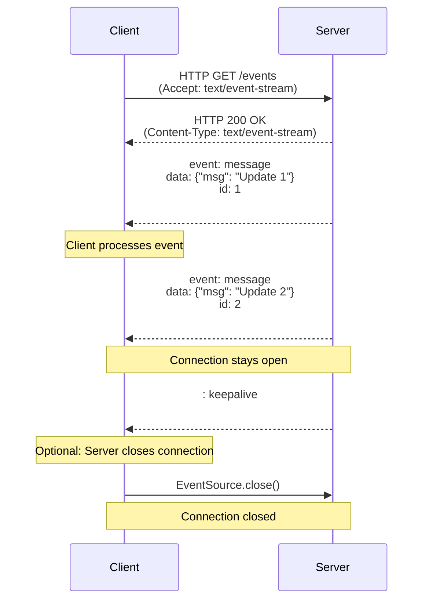

# 💳 Real-Time Payment Status POC (Kotlin + Quarkus + SSE)

This project demonstrates a simple **real-time payment status tracker** using:

* **Backend**: Kotlin + Quarkus (JDK 21, Gradle 8.14.x)
* **Frontend**: React (uses native `EventSource` API)
* **Communication**: Server-Sent Events (**SSE**) via `SseEventSink`

The goal: instead of repeatedly polling the server for updates, the client keeps one open connection, and the server pushes status changes in **real-time**.

---

## 🚀 Features

* Exposes an SSE endpoint `/payment/events/status`
* Server emits events sequentially: `PENDING → PROCESSING → SUCCESSFUL`
* React UI displays: `Your latest payment status is - <STATUS>`
* Uses `Sse` + `SseEventSink` API (Jakarta standard) instead of coroutines `Flow`

## 📊 How SSE Works

* Client opens **one HTTP connection** using `EventSource`.
* Server keeps connection open and **pushes events** when ready.
* Client updates UI live without polling.

---

## ✅ Advantages of SSE

* Native browser support (`EventSource` → no extra libs)
* Lightweight compared to polling
* One persistent connection per client
* Perfect for **status updates, notifications, dashboards**

---
